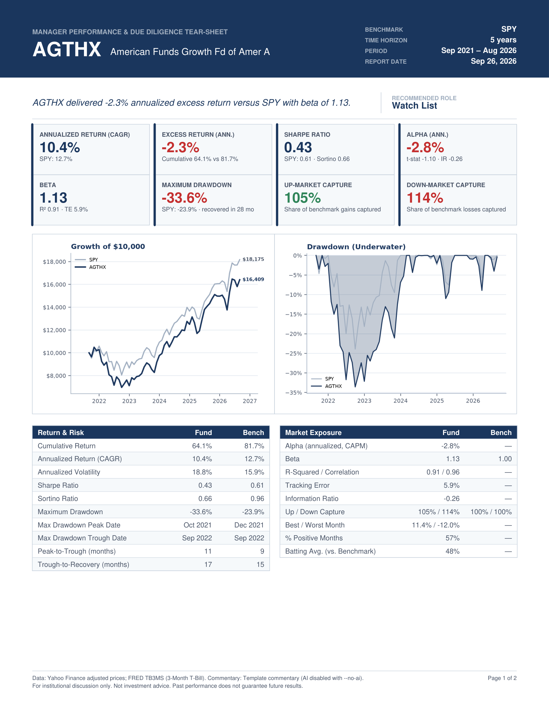

# Manager Performance & Due Diligence Tear-Sheet

Builds a two-page PDF tear-sheet for a mutual fund or ETF against a benchmark:
monthly risk/return analytics, charts, and an AI-written due-diligence memo.

```
data_loader.py    yfinance adjusted prices -> month-end returns; FRED TB3MS risk-free rate; macro snapshot
analytics.py      CAGR, volatility, drawdown/recovery, Sharpe, Sortino, IR, alpha/beta, TE, capture; charts
ai_commentary.py  free open-model LLM commentary (4 sections, JSON) with a rule-based fallback
pdf_generator.py  ReportLab 2-page tear-sheet
main.py           interactive CLI with progress steps
```

## 📄 Sample Report Output

5-year tear-sheet for `AGTHX` (American Funds Growth Fund of America) against `SPY`. Click the preview to open the full two-page PDF.

[](assets/sample_tearsheet.pdf)

> 🔗 **[View or Download Full Sample PDF Report (assets/sample_tearsheet.pdf)](assets/sample_tearsheet.pdf)**

## Setup

```sh
cd ~/manager-tearsheet
python3 -m venv .venv && source .venv/bin/activate
pip install -r requirements.txt
```

### AI commentary (free, pick one; optional)

Without either option the report still renders, using rule-based template commentary.

**Groq (hosted, free tier, fastest to set up):** create a key at https://console.groq.com/keys, then
```sh
export GROQ_API_KEY=gsk_...          # uses llama-3.3-70b-versatile
```

**Ollama (local, no key, offline):**
```sh
brew install ollama
ollama serve &                        # or open the Ollama app
ollama pull llama3.1:8b               # ~4.9 GB download
```

The app uses Groq if `GROQ_API_KEY` is set, otherwise a running Ollama server. Overrides:
`LLM_PROVIDER=groq|ollama|custom`, `LLM_MODEL=...` (e.g. `openai/gpt-oss-120b` on Groq,
`qwen2.5:7b` on Ollama). `custom` takes any OpenAI-compatible endpoint via `LLM_BASE_URL` and `LLM_API_KEY`.

## Run

```sh
python main.py                             # prompts for fund, benchmark, years
python main.py -f AGTHX -b SPY -y 5        # non-interactive
python main.py -f PRWCX -b AOR -y 10 --no-open --no-ai
```

PDFs are written to `outputs/TearSheet_<FUND>_<YYYYMMDD_HHMMSS>.pdf`. Chart PNGs are
generated in a temporary directory and deleted after rendering.

## Notes

- **Provider** used for the commentary is printed in the PDF footer.
- **Macro backdrop**: the prompt includes live, dated FRED data (Fed Funds, 3M T-bill, 10Y,
  yield curve, CPI YoY, unemployment) and trailing 12-month Russell 1000 Growth vs. Value
  (IWF/IWD). Anything that fails to download is left out rather than guessed.
- **Window**: uses complete calendar months only, ending at the last full month. If the fund's
  history is shorter than requested, the common period is used and noted on the PDF.
- **Risk-free rate**: FRED via `pandas_datareader`, then FRED's CSV endpoint, then a 4.0% fallback.
- **Methodology** is printed at the bottom of page 2.
